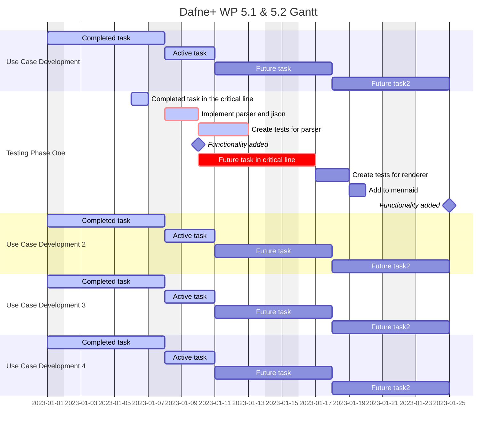

```mermaid
gantt
    dateFormat  YYYY-MM-DD
    title       Dafne+ WP 5.1 & 5.2 Gantt
    excludes    weekends
    %% (`excludes` accepts specific dates in YYYY-MM-DD format, days of the week ("sunday") or "weekends", but not the word "weekdays".)

    section Use Case Development
    Completed task            :active,    des1, 2023-01-01,2023-01-08
    Active task               :active,  des2, 2023-01-08, 3d
    Future task               :         des3, after des2, 5d
    Future task2              :         des4, after des3, 5d

    section Testing Phase One
    Completed task in the critical line :active, 2023-01-06,24h
    Implement parser and jison          :crit, active, after des1, 2d
    Create tests for parser             :crit, active, 3d
    Functionality added                 :milestone, 2023-01-10, 0d
    Future task in critical line        :crit, 5d
    Create tests for renderer           :2d 
    Add to mermaid                      :1d
    Functionality added                 :milestone, 2023-01-25, 0d
    
    section Use Case Development 2
    Completed task            :active,    des1, 2023-01-01,2023-01-08
    Active task               :active,  des2, 2023-01-08, 3d
    Future task               :         des3, after des2, 5d
    Future task2              :         des4, after des3, 5d
    
    section Use Case Development 3
    Completed task            :active,    des1, 2023-01-01,2023-01-08
    Active task               :active,  des2, 2023-01-08, 3d
    Future task               :         des3, after des2, 5d
    Future task2              :         des4, after des3, 5d
    
    section Use Case Development 4
    Completed task            :active,    des1, 2023-01-01,2023-01-08
    Active task               :active,  des2, 2023-01-08, 3d
    Future task               :         des3, after des2, 5d
    Future task2              :         des4, after des3, 5d

```
